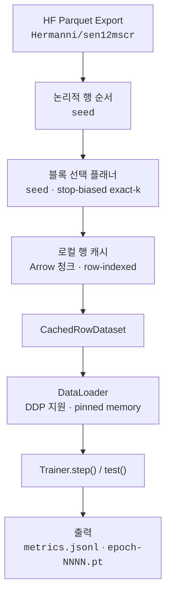

<h1 align="center">cr-train</h1>

<p align="center">
  <em>SEN12MS-CR 위성 구름 제거를 위한 HuggingFace 연동 학습 모듈</em>
</p>

<p align="center">
  <a href="https://www.python.org/downloads/"></a>
  <a href="https://pytorch.org/"></a>
  <a href="https://huggingface.co/datasets/Hermanni/sen12mscr"></a>
</p>

<p align="center">
  <a href="README.md">English</a> | <b>한국어</b>
</p>

---

## 주요 특징

- **단일 클래스 API** -- `Trainer`의 `step()` + `test()`만으로 학습 완료
- **결정적 블록 샘플링** -- 단일 시드 시스템(`seed`)으로 완벽한 재현성
- **스마트 캐시 워밍업** -- HF Parquet shard에서 누락된 행만 읽고, 다른 계획에서도 재사용
- **분산 학습** -- 자동 DDP 래핑, `DistributedSampler`, all-reduce 메트릭
- **JSONL 실험 기록** -- 매 epoch, 검증, 체크포인트, 시작 이벤트를 `metrics.jsonl`에 기록
- **별도 데이터 다운로드 불필요** -- [`Hermanni/sen12mscr`](https://huggingface.co/datasets/Hermanni/sen12mscr)의 Parquet export를 직접 사용

---

## 빠른 시작

### 설치

```bash
uv add git+https://github.com/smturtle2/cr-train.git
```

### 최소 예제

```python
from cr_train import Trainer
import torch
from torch import nn
from torch.nn import functional as F

class FusionBaseline(nn.Module):
    def __init__(self):
        super().__init__()
        # SAR 2채널 + 구름 낀 광학 13채널 = 총 15 입력 채널
        self.body = nn.Sequential(
            nn.Conv2d(15, 64, 3, padding=1), nn.GELU(),
            nn.Conv2d(64, 64, 3, padding=1), nn.GELU(),
            nn.Conv2d(64, 13, 1),  # 타겟 광학 13채널
        )

    def forward(self, sar, cloudy):
        return self.body(torch.cat([sar, cloudy], dim=1))

device = torch.device("cuda" if torch.cuda.is_available() else "cpu")
model = FusionBaseline().to(device)
optimizer = torch.optim.AdamW(model.parameters(), lr=1e-4)

trainer = Trainer(
    model, optimizer,
    loss=lambda pred, batch: F.l1_loss(pred, batch["target"]),
    metrics={"mae": lambda pred, batch: torch.mean(torch.abs(pred - batch["target"]))},
    max_train_samples=2048,
    max_val_samples=256,
    max_test_samples=256,
    batch_size=4,
    epochs=2,
    seed=42,
    output_dir="runs/sen12mscr",
)

for _ in range(trainer.epochs):
    print(trainer.step())

print(trainer.test())
```

---

## 예제

### CLI 학습

내장된 `FusionBaseline` 모델로 학습 스크립트를 실행합니다:

```bash
uv run python examples/train_sen12mscr.py \
  --max-train-samples 2048 \
  --max-val-samples 256 \
  --max-test-samples 256 \
  --batch-size 4 \
  --epochs 2 \
  --output-dir runs/sen12mscr-example
```

`--max-train-samples none` (또는 `full`)을 전달하면 전체 split을 캐싱하여 학습합니다.

### 샘플링 알고리즘 시각화

블록 선택 비트마스크가 단계별로 어떻게 구축되는지 확인합니다:

```bash
uv run python examples/bitmask_sampling_demo.py \
  --total-rows 107072 \
  --requested-rows 2048 \
  --seed 9
```

stop block 확률표, 샘플링된 stop, prefix draw, 그리고 선택(`■`) vs. 건너뜀(`□`)의 최종 비트맵을 출력합니다.

---

## 아키텍처



---

## API 레퍼런스

### `Trainer.__init__`

| 파라미터 | 타입 | 기본값 | 설명 |
|----------|------|--------|------|
| `model` | `nn.Module` | *(필수)* | PyTorch 모델. `forward(sar, cloudy)` 시그니처, 예측 텐서를 반환. |
| `optimizer` | `Optimizer` | *(필수)* | `model.parameters()`로 생성해야 함. |
| `loss` | `Callable` | *(필수)* | `(prediction, batch) -> 스칼라 텐서`. |
| `metrics` | `dict[str, Callable]` | `None` | `{"이름": (prediction, batch) -> 스칼라}`. epoch별 기록. |
| `max_train_samples` | `int \| None` | `None` | 요청 학습 행 수. 고정 `BLOCK_SIZE=64` 기준으로 블록 수로 변환. `None` = 전체 split. |
| `max_val_samples` | `int \| None` | `None` | 검증용 동일. |
| `max_test_samples` | `int \| None` | `None` | 테스트용 동일. |
| `batch_size` | `int` | `4` | 모든 DataLoader의 배치 크기. |
| `epochs` | `int` | `1` | 총 학습 epoch 수. epoch당 `step()` 한 번 호출. |
| `seed` | `int` | `42` | 결정적 row-group block 순서와 블록 선택을 함께 제어하는 시드. |
| `output_dir` | `str \| Path` | `"runs/default"` | `metrics.jsonl` 및 체크포인트 파일 디렉토리. |
| `cache_dir` | `str \| Path \| None` | `None` | 행 캐시 루트. `None` = `~/.cache/cr-train`. |

### `Trainer.step() -> dict`

학습 1 epoch + 검증 + 체크포인트를 실행합니다. 반환값:

```python
{
    "epoch": 1,
    "train": {
        "loss": 0.0423,
        "metrics": {"mae": 0.0312},
        "num_samples": 2048,
        "num_batches": 512,
        "samples_per_sec": 142.3,
        "batches_per_sec": 17.8,
    },
    "val": {
        "loss": 0.0391,
        "metrics": {"mae": 0.0298},
        "num_samples": 256,
        "num_batches": 64,
    },
    "checkpoint_path": "runs/sen12mscr/epoch-0001.pt",
}
```

### `Trainer.test() -> dict`

현재 모델 상태로 테스트를 실행합니다. 반환값:

```python
{
    "epoch": 2,
    "loss": 0.0387,
    "metrics": {"mae": 0.0295},
    "num_samples": 256,
    "num_batches": 64,
}
```

---

## 동작 원리

### 행 기반 캐싱

소스 데이터셋은 HF dataset viewer의 Parquet 메타데이터로 한 번 기술되고, 이후 워밍업은 split 단위 **row-indexed cache**를 채웁니다. logical block은 샘플링과 tqdm 표시를 위해 유지되며, 이제 block 하나는 source `row_group` 하나와 같습니다. 디스크 캐시는 global row id 기준으로 저장되어 다른 계획에서도 재사용됩니다.

```
~/.cache/cr-train/layout-v10/<source>/row_store/<split>/
├── chunks/             # raw row를 담는 Arrow IPC 청크
├── state.json          # 캐시 상태 (행 수, 다음 chunk id)
├── chunk_ids.npy       # global row id → chunk id
├── row_offsets.npy     # global row id → chunk 내부 row offset
└── cached_rows.npy     # 캐시된 global row id의 boolean 마스크
```

### 결정적 샘플링

완벽한 재현성을 위해 하나의 시드를 사용합니다:

| 시드 | 제어 대상 | 효과 |
|------|-----------|------|
| `seed` | row-group block 순서 + 블록 선택 | source `row_group` block의 결정적 순서를 만들고, 그 위에서 stop-biased exact-k 플래너가 logical block을 선택. |

플래너는 항상 정확한 블록 수를 결정적으로 반환합니다. 요청된 row 수는 고정 `BLOCK_SIZE=64` 기준으로 블록 수로 변환되고, 선택은 항상 전체 `row_group` 단위로 이뤄집니다. 동일한 `seed` = 동일한 row-group block 순서와 블록 선택. 다른 `seed`값은 다른 block 순서와 논리 블록을 샘플링합니다.

### 캐시 워밍업 생명주기

1. 첫 번째 `step()` 또는 `test()` 호출 시, 세 split(train, validation, test) 모두 워밍업 실행.
2. 플래너가 선택된 logical block과 이미 캐시된 행을 비교.
3. 누락된 행만 HuggingFace Parquet shard에서 읽음. 선택된 블록이 모두 캐시되어 있으면 원격 소스에 접속하지 않음.
4. tqdm 프로그레스 바로 logical block 워밍업을 추적하고, 완료 시 블록 타임라인을 출력:

```
██░░██████░░░░██████████░░██ cache train | warm | selected=42 fill=42/42
```

`█` = 선택된 logical block, `░` = 샘플링된 stop block 이전에서 건너뛴 block.

---

## 분산 학습

`torch.distributed`가 초기화되면 Trainer가 자동으로 모델을 `DistributedDataParallel`로 래핑합니다. 코드 변경이 필요 없습니다:

```bash
torchrun --nproc_per_node=2 examples/train_sen12mscr.py \
  --max-train-samples 4096 \
  --epochs 5
```

- `DistributedSampler`로 rank별 데이터 분할
- 모든 프로세스에 걸쳐 메트릭 all-reduce
- rank 0만 `metrics.jsonl`과 체크포인트 파일 기록
- 파일 락을 통한 캐시 워밍업 조율

---

## 모델 규약

모델의 `forward` 메서드는 **두 개의 위치 인자**를 받습니다:

| 인자 | Shape | Dtype | 설명 |
|------|-------|-------|------|
| `sar` | `[B, 2, 256, 256]` | `float32` | Sentinel-1 SAR 영상 (2채널) |
| `cloudy` | `[B, 13, 256, 256]` | `float32` | 구름 낀 Sentinel-2 광학 영상 (13채널) |

**출력**: 예측 텐서, 일반적으로 `[B, 13, 256, 256]`.

```python
class MyModel(nn.Module):
    def forward(self, sar, cloudy):
        # sar:    [B, 2,  256, 256]
        # cloudy: [B, 13, 256, 256]
        x = torch.cat([sar, cloudy], dim=1)  # [B, 15, 256, 256]
        return self.network(x)
```

**손실 함수**와 **메트릭 함수**는 `(prediction, batch)`를 입력받으며, `batch`는 `"sar"`, `"cloudy"`, `"target"`, `"meta"`를 포함하는 전체 dict입니다:

```python
def my_loss(prediction, batch):
    return F.l1_loss(prediction, batch["target"])
```

---

## 참고사항

- 캐시 워밍업 시 tqdm 프로그레스 바로 블록 다운로드를 표시하고, 완료 시 블록 타임라인을 출력합니다.
- 동일한 `seed`는 같은 블록 선택을 유지하며, 학습 배치 순서는 `seed + epoch_index`로 epoch마다 변경됩니다.
- 완료된 캐시는 자동 삭제되지 않습니다. 디스크 공간 회수를 위해 캐시 디렉토리에서 직접 삭제하세요.
- `Trainer.step()`은 학습 중 배치 단위 tqdm으로 running-average loss와 메트릭을 표시합니다.
- 체크포인트는 `epoch-NNNN.pt` 형태로 저장되며, `model`, `optimizer`, `epoch`, `global_step` 상태를 포함합니다.
- 메트릭은 출력 디렉토리의 `metrics.jsonl`에 줄 단위 JSON 객체로 기록됩니다.

---

## 라이선스

이 프로젝트에는 아직 라이선스가 지정되지 않았습니다. `LICENSE` 파일을 추가하여 배포 조건을 명시해 주세요.
