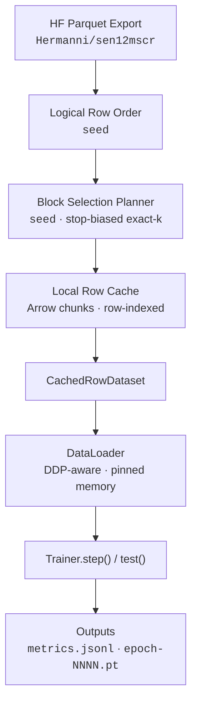

<h1 align="center">cr-train</h1>

<p align="center">
  <em>HuggingFace-backed training module for satellite cloud removal on SEN12MS-CR</em>
</p>

<p align="center">
  <a href="https://www.python.org/downloads/"></a>
  <a href="https://pytorch.org/"></a>
  <a href="https://huggingface.co/datasets/Hermanni/sen12mscr"></a>
</p>

<p align="center">
  <b>English</b> | <a href="README.ko.md">한국어</a>
</p>

---

## Highlights

- **Single-class API** -- `Trainer` with `step()` + `test()`, nothing else to learn
- **Deterministic block sampling** -- one-seed system (`seed`) for exact reproducibility
- **Smart cache warmup** -- reads only missing rows from HF Parquet shards and reuses them across plans
- **Distributed training** -- automatic DDP wrapping, `DistributedSampler`, all-reduce metrics
- **JSONL experiment tracking** -- every epoch, validation, checkpoint, and startup event recorded to `metrics.jsonl`
- **Zero config data** -- ingests directly from [`Hermanni/sen12mscr`](https://huggingface.co/datasets/Hermanni/sen12mscr) Parquet exports; no manual download needed

---

## Quick Start

### Installation

```bash
uv add git+https://github.com/smturtle2/cr-train.git
```

### Minimal example

```python
from cr_train import Trainer
import torch
from torch import nn
from torch.nn import functional as F

class FusionBaseline(nn.Module):
    def __init__(self):
        super().__init__()
        # 2 SAR channels + 13 cloudy optical channels = 15 input channels
        self.body = nn.Sequential(
            nn.Conv2d(15, 64, 3, padding=1), nn.GELU(),
            nn.Conv2d(64, 64, 3, padding=1), nn.GELU(),
            nn.Conv2d(64, 13, 1),  # 13 target optical channels
        )

    def forward(self, sar, cloudy):
        return self.body(torch.cat([sar, cloudy], dim=1))

device = torch.device("cuda" if torch.cuda.is_available() else "cpu")
model = FusionBaseline().to(device)
optimizer = torch.optim.AdamW(model.parameters(), lr=1e-4)

trainer = Trainer(
    model, optimizer,
    loss=lambda pred, batch: F.l1_loss(pred, batch["target"]),
    metrics={"mae": lambda pred, batch: torch.mean(torch.abs(pred - batch["target"]))},
    max_train_samples=2048,
    max_val_samples=256,
    max_test_samples=256,
    batch_size=4,
    epochs=2,
    seed=42,
    output_dir="runs/sen12mscr",
)

for _ in range(trainer.epochs):
    print(trainer.step())

print(trainer.test())
```

---

## Examples

### CLI training

Run the bundled training script with the built-in `FusionBaseline` model:

```bash
uv run python examples/train_sen12mscr.py \
  --max-train-samples 2048 \
  --max-val-samples 256 \
  --max-test-samples 256 \
  --batch-size 4 \
  --epochs 2 \
  --output-dir runs/sen12mscr-example
```

Pass `--max-train-samples none` (or `full`) to cache and train on the entire split.

### Sampling algorithm visualization

See how the block-selection bitmask is built step by step:

```bash
uv run python examples/bitmask_sampling_demo.py \
  --total-rows 107072 \
  --requested-rows 2048 \
  --seed 9
```

Output shows the stop-block probability table, the sampled stop, the prefix draws, and a final bitmap of selected (`■`) vs. skipped (`□`) blocks.

---

## Architecture



---

## API Reference

### `Trainer.__init__`

| Parameter | Type | Default | Description |
|-----------|------|---------|-------------|
| `model` | `nn.Module` | *(required)* | PyTorch model. `forward(sar, cloudy)` signature, returns a prediction tensor. |
| `optimizer` | `Optimizer` | *(required)* | Must be constructed from `model.parameters()`. |
| `loss` | `Callable` | *(required)* | `(prediction, batch) -> scalar tensor`. |
| `metrics` | `dict[str, Callable]` | `None` | `{"name": (prediction, batch) -> scalar}`. Logged per epoch. |
| `max_train_samples` | `int \| None` | `None` | Requested train rows. Converted to block count using the fixed `BLOCK_SIZE=64` accounting unit. `None` = full split. |
| `max_val_samples` | `int \| None` | `None` | Same for validation. |
| `max_test_samples` | `int \| None` | `None` | Same for test. |
| `batch_size` | `int` | `4` | Batch size for all DataLoaders. |
| `epochs` | `int` | `1` | Total training epochs. Call `step()` once per epoch. |
| `seed` | `int` | `42` | Seed controlling deterministic row-group block order and block selection. |
| `output_dir` | `str \| Path` | `"runs/default"` | Directory for `metrics.jsonl` and checkpoint files. |
| `cache_dir` | `str \| Path \| None` | `None` | Row cache root. `None` = `~/.cache/cr-train`. |

### `Trainer.step() -> dict`

Runs one training epoch + validation + checkpoint. Returns:

```python
{
    "epoch": 1,
    "train": {
        "loss": 0.0423,
        "metrics": {"mae": 0.0312},
        "num_samples": 2048,
        "num_batches": 512,
        "samples_per_sec": 142.3,
        "batches_per_sec": 17.8,
    },
    "val": {
        "loss": 0.0391,
        "metrics": {"mae": 0.0298},
        "num_samples": 256,
        "num_batches": 64,
    },
    "checkpoint_path": "runs/sen12mscr/epoch-0001.pt",
}
```

### `Trainer.test() -> dict`

Runs test evaluation with the current model state. Returns:

```python
{
    "epoch": 2,
    "loss": 0.0387,
    "metrics": {"mae": 0.0295},
    "num_samples": 256,
    "num_batches": 64,
}
```

---

## How It Works

### Row-indexed caching

The source dataset is described once via the HF dataset viewer Parquet metadata. Warmup then fills a split-wide **row-indexed cache**. Logical blocks still exist for planning and tqdm display, but each logical block is now one source `row_group`, and the on-disk cache is keyed by global row id and reused across different plans.

```
~/.cache/cr-train/layout-v10/<source>/row_store/<split>/
├── chunks/             # Arrow IPC chunks with raw rows
├── state.json          # cache state (row counts, next chunk id)
├── chunk_ids.npy       # global row id → chunk id
├── row_offsets.npy     # global row id → row offset inside the chunk
└── cached_rows.npy     # boolean mask of cached global row ids
```

### Deterministic sampling

The system uses one seed for full reproducibility:

| Seed | Controls | Effect |
|------|----------|--------|
| `seed` | Row-group block order + block selection | Derives a deterministic order over source `row_group` blocks and then samples logical blocks from the full block order with a stop-biased exact-k planner. |

The planner remains deterministic and always returns exactly the required block count. The requested row count is converted to a block count using the fixed `BLOCK_SIZE=64` accounting unit, then full row-group blocks are sampled. Same `seed` = same row-group block order and block selection across runs. Different `seed` values sample different logical blocks and block orderings.

### Cache warmup lifecycle

1. On the first `step()` or `test()`, warmup runs for all three splits (train, validation, test).
2. The planner compares selected logical blocks against already-cached rows.
3. Only missing rows are read from HuggingFace Parquet shards. If every selected block is already covered, the remote source is never contacted.
4. A tqdm progress bar tracks logical-block warmup. On completion, a block timeline is printed:

```
██░░██████░░░░██████████░░██ cache train | warm | selected=42 fill=42/42
```

`█` = selected logical block, `░` = skipped block before the sampled stop block.

---

## Distributed Training

Trainer auto-wraps the model in `DistributedDataParallel` when `torch.distributed` is initialized. No code changes needed:

```bash
torchrun --nproc_per_node=2 examples/train_sen12mscr.py \
  --max-train-samples 4096 \
  --epochs 5
```

- Data is sharded across ranks via `DistributedSampler`
- Metrics are all-reduced across all processes
- Only rank 0 writes `metrics.jsonl` and checkpoint files
- Cache warmup runs on all ranks with file-lock coordination

---

## Model Contract

Your model's `forward` method receives **two positional arguments**:

| Argument | Shape | Dtype | Description |
|----------|-------|-------|-------------|
| `sar` | `[B, 2, 256, 256]` | `float32` | Sentinel-1 SAR image (2 channels) |
| `cloudy` | `[B, 13, 256, 256]` | `float32` | Cloudy Sentinel-2 optical image (13 channels) |

**Output**: a prediction tensor, typically `[B, 13, 256, 256]`.

```python
class MyModel(nn.Module):
    def forward(self, sar, cloudy):
        # sar:    [B, 2,  256, 256]
        # cloudy: [B, 13, 256, 256]
        x = torch.cat([sar, cloudy], dim=1)  # [B, 15, 256, 256]
        return self.network(x)
```

The **loss** and **metric** functions receive `(prediction, batch)` where `batch` is the full dict containing `"sar"`, `"cloudy"`, `"target"`, and `"meta"`:

```python
def my_loss(prediction, batch):
    return F.l1_loss(prediction, batch["target"])
```

---

## Notes

- Cache warmup shows a tqdm progress bar during block download and prints a block timeline on completion.
- Equal `seed` values keep the same block-selection membership; train batch order still changes by epoch via `seed + epoch_index`.
- Finished caches are never auto-deleted. Remove them manually from the cache directory to reclaim disk space.
- `Trainer.step()` shows running-average loss and metrics with batch-level tqdm during training.
- Checkpoints are saved as `epoch-NNNN.pt` containing `model`, `optimizer`, `epoch`, and `global_step` state dicts.
- Metrics are appended to `metrics.jsonl` in the output directory (one JSON object per line).

---

## License

This project is currently unlicensed. Please add a `LICENSE` file to specify your terms.
